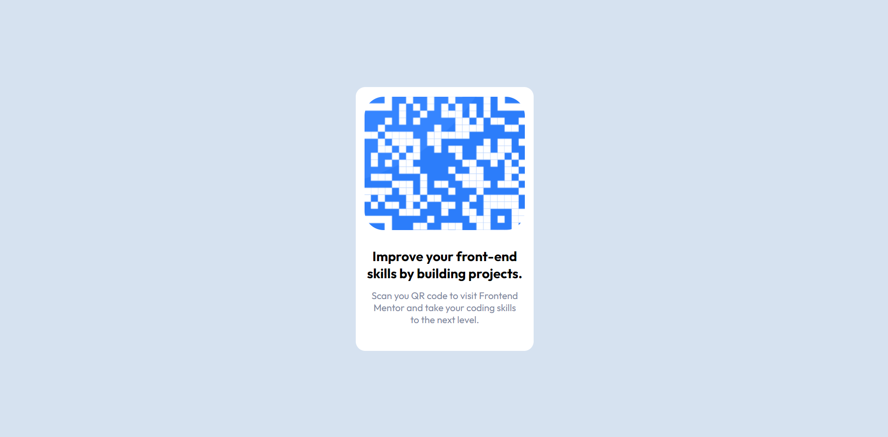

# Frontend Mentor - QR code component solution

This is a solution to the [QR code component challenge on Frontend Mentor](https://www.frontendmentor.io/challenges/qr-code-component-iux_sIO_H). Frontend Mentor challenges help you improve your coding skills by building realistic projects. 

## Table of contents

- [Overview](#overview)
  - [Links](#links)
- [My process](#my-process)
  - [Built with](#built-with)
  - [What I learned](#what-i-learned)
  - [Continued development](#continued-development)
  - [Useful resources](#useful-resources)
- [Author](#author)
- [Acknowledgments](#acknowledgments)

**Note: Delete this note and update the table of contents based on what sections you keep.**

## Overview

A QR code component designed with HTML and CSS.

### Links

- Solution URL: [Add solution URL here](https://github.com/FloratobyDev/QR-Code-Design)
- Live Site URL: [Add live site URL here](https://teal-raindrop-91e2ea.netlify.app/)

## My process

**PROCESS**

I initially started by reading the `README.md` of the starting project first to get a better understanding of the problem. As I've learned through the years, reading the instructions carefully has always been a good idea. Missing a point can cost more time and energy.

After reading the instructions, I started with structuring my **HTML** to get a better look at how I should style it later.   
It may not be the final structure but building a foundation for it has always been a good approach for me, especially when it's time to work on the styling. Styling the page took a bit of time for me as I'm not fully familiar with some of the properties I had to use. It was pretty straightforward until I had to work on the image part. I didn't know whether I should just use the *background property* or create an *img element* inside a div. So I tried both. I struggled trying to get it to look right when I tried using the *background property* and I couldn't get it right. The image is zoomed in like so: 



So after feeling frustrated, I switched to the *img element* idea. I had one problem with it and that is this: 


The bottom side of the image was not set properly. I tried adding **height: 200px** and that seemed to have fixed it but now the problem is that it's too small. So I increased the height a bit and more problems occurred. So I was pretty frustrated at this point and began debugging. In the end, I was able to figure out that the img needs to be centered as well. My thought was that, the image was already centered. So after figuring out what was causing the problem, I was able to fixed it. The solution was to simply add the following code : 

 ```css
.image-container {
  display: flex;
  align-items: center;
  justify-content: center
}
```
It worked! After that, everything was pretty much set and is ready to be submitted. It was a good experience for sure.

**REFLECTION**

I've been using [**SASS**](https://sass-lang.com/) for a few weeks now, and I forgot what it felt like to style a website with just Pure CSS. It's a good feeling to get back on to it from time to time. However, SASS is just a great CSS pre-compiler extension, so I'm probably going to keep styling my web projects with it. 


### Built with

- Semantic HTML5 markup
- CSS custom properties
- Flexbox
- Desktop-first workflow

### Useful resources

- [background property](https://www.w3schools.com/css/css_background.asp) - Great when I'm trying to brush up on my CSS knowledge.
## Author

- Website - [Michael Mushrush](https://michaelmushrush.tech/)

